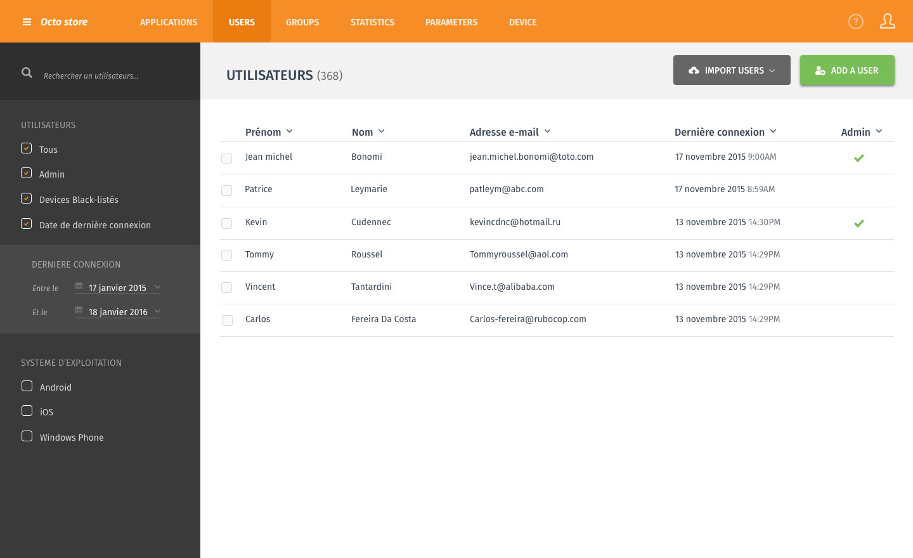
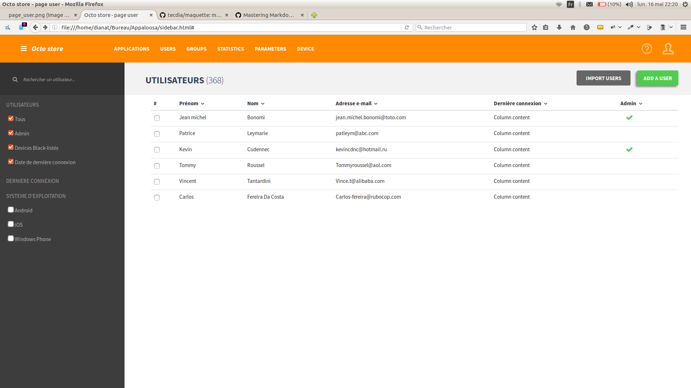
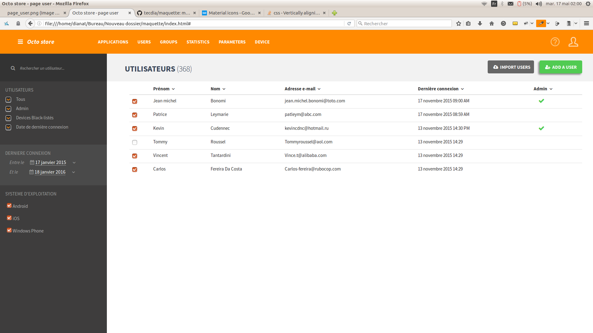
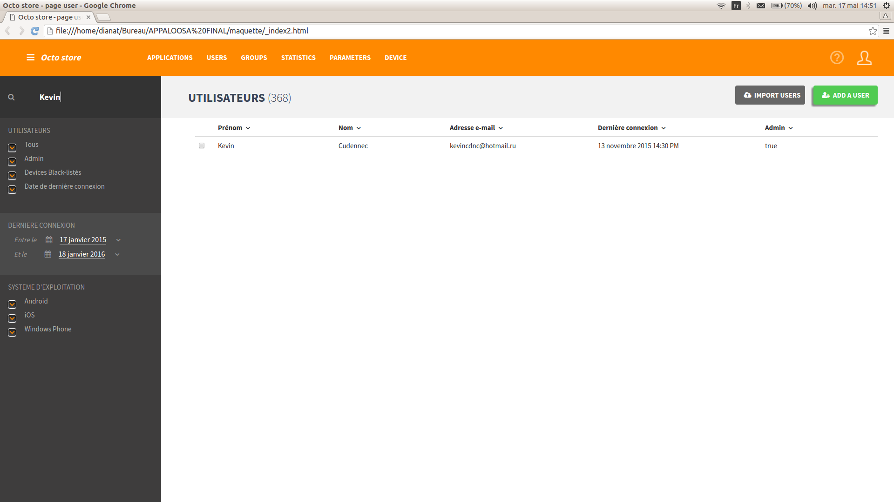

# page user
made with love :blush:

Résultat final **[ici](https://tecdia.github.io/maquette/)**

Maquette à reproduire :

@22h20 (résolution 1920x1080 16:9 - Ubuntu)

@02h00 (résolution 1920x1080 16:9 - Ubuntu)

#### difficultés rencontrées :
- aligner le fond gri du titre principal, avec la (pseudo) search box du panel de gauche
- stylisation des checkbox
- tri sur un tableau bootstrap
- aspect responsive

pas de JS intégré

#### mardi 17 mai : modifs ajoutées :
- plugin dataTable jQuery pour trier le tableau
- input ajoutée dans le panel de gauche (fail sur le filtre des données via datatable)

@14h50

- un peu d'angular ajouté : recherche par utilisateurs affichés OK
- icône verte du statut admin NOK

@16h40
- icône verte statut admin OK.

##### CONCLUSION :
je n'ai pas fini d'améliorer. 
La résolution de ma machine est élevée, bien que je l'ai diminuée, il est probable que d'un ordi à un autre l'affichage varie.
Merci de m'avoir donné cet exercice sympa. N'hésitez à m'en envoyer d'autres ou à me donner des conseils.
